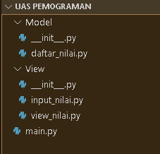
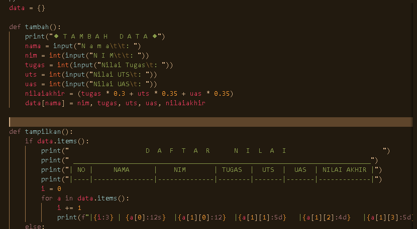
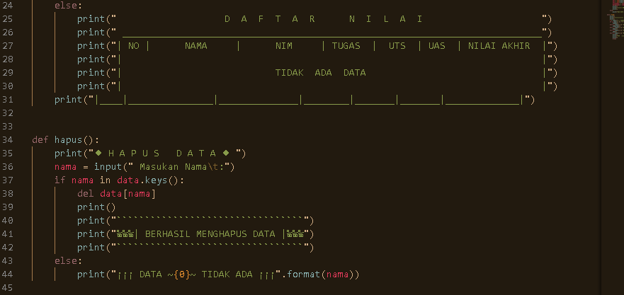
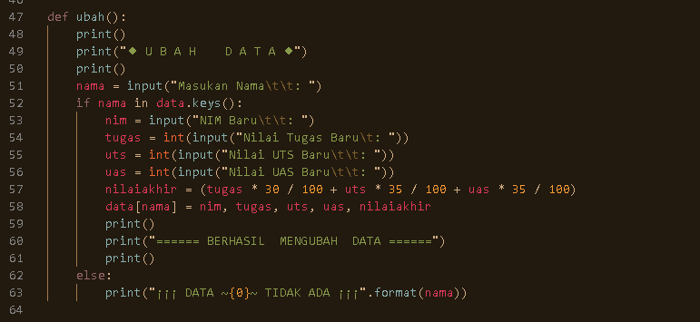
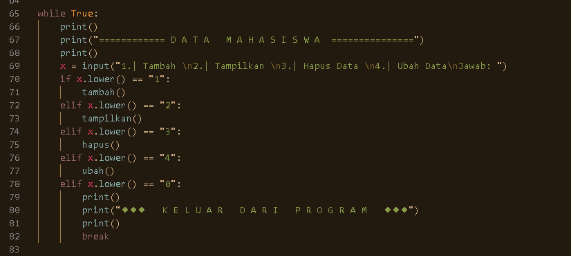
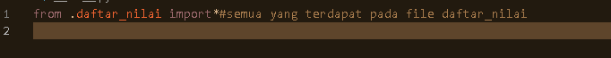
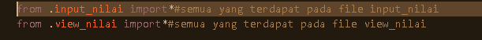
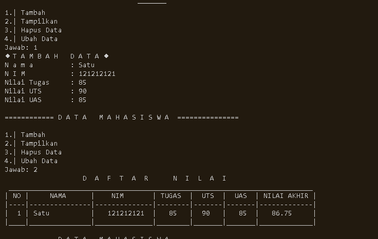

# Ujian_Akhir_Semester
## Membuat package dan modul dengan struktur

Pertama buatlah sebuah file dengan nama daftar_nilai kemudian isi file dengan beberapa fungsi
seperti di bawah ini :  

Namun untuk bisa mengakses file tersebut kita menggunakan file __init__.py yang berfungsi
sebagai file yang akan dijalankan atau dieksekusi terlebih dahalu ketika kita menjalankan
file-file yang terdapat didalam satu folder.  

inilah tampilan output program  

